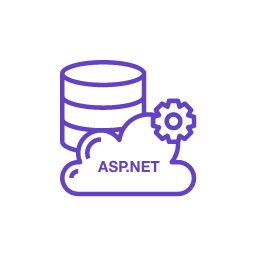

# AspNetCore.Tools

 [![NuGet: AspNetCore.Tools][1]][2]
 [![License][7]][8]



This library provides a bunch of useful methods for working with `AspNetCore` applications: automatic registration of services, middlewares and model binders, automatic generation of model binder providers, tools for switching from *Ugly Fat Controllers* to *Nice Skinny Controllers*, and much much more!

## Available Packages:

| Description  | Package |
| ------------- | ------------- |
| Main library  | [![NuGet: AspNetCore.Tools][1]][2] |
| Plugin that allows you to store complex objects into `ISession`  | [![NuGet: AspNetCore.Tools.Session.NewtonsoftJson][3]][4] |
| Plugin that allows you to store complex objects into `ISession`  | [![NuGet: AspNetCore.Tools.Session.ProtobufNet][5]][6] |

## Quick Start Guide

Here you can consider the main features of the library. Check out the [documentation](https://kir-antipov.github.io/AspNetCore.Tools/Help) for more details.

### 1. Automatic registration of services

Tired of hundreds of lines of similar code in `Startup.cs` that need to be updated all the time?

```csharp
services.AddScoped<IMyService1, MyService1>();
services.AddScoped<IMyService2, MyService2>();
services.AddScoped<IMyService3, MyService3>();
...
services.AddSingleton<IMyService100, MyService100>();
```

Let us do all the work for you!

```csharp
services.AddMarked();
```

This one simple line of code will automatically register all services that you marked with one of the attributes:

 - `[ScopedService]` - `services.AddScoped` replacement
 - `[TransientService]` - `services.AddTransient` replacement
 - `[SingletonService]` - `services.AddSingleton` replacement
 - `[HostedService]` - `services.AddHostedService` replacement

Examples:

```csharp
// Since we marked the interface, the method will automatically
// find the first suitable implementation of it,
// which in our case is `MyService` class.

[ScopedService]
public interface IMyService { }

public class MyService : IMyService { }

 ...

// In this case, we marked the implementation,
// and indicated how it should be interpreted.

public interface IMyAnotherService { }

[ScopedService(ServiceType = typeof(IMyAnotherService))]
public class MyAnotherService : IMyAnotherService { }
```

One more thing...™

By default, you can't create a **Singleton** service that requires a **Scoped** service:

```csharp
public class MySingleton
{
    public MySingleton(MyScoped scoped) { }
}

public class MyScoped { }

 ...

// This won't work
services.AddScoped<MyScoped>();
services.AddSingleton<MySingleton>();
```

With this library you'll forget about this problem:

```csharp
[SingletonService]
public class MySingleton
{
    public MySingleton(MyScoped scoped) { }
}

[ScopedService]
public class MyScoped { }

 ...

// Totally fine
services.AddMarked();
```

### 1.5. Automatic registration of service factories

It's pretty the same story as about services themselves. There're few more attributes you should know about:

 - `[ScopedServiceFactory]` - `services.AddScoped` replacement
 - `[TransientServiceFactory]` - `services.AddTransient` replacement
 - `[SingletonServiceFactory]` - `services.AddSingleton` replacement
 - `[HostedServiceFactory]` - `services.AddHostedService` replacement

Every class marked with one of these attributes will be registered as a valid service factory.

Examples:

```csharp
public interface IMyScoped { }

public class MyScoped : IMyScoped { }


// Since we marked the interface, the method will automatically
// find the first suitable implementation of it,
// which in our case is `MyScopedFactory` class.

[ScopedServiceFactory]
public interface IMyScopedFactory : IServiceFactory<IMyScoped> { }

public class MyScopedFactory : IMyScopedFactory
{
    public IMyScoped GetService(IServiceCollection services) => new MyScoped();
}

...

services.AddMarked();
```

### 2. Automatic registration of middlewares

Tired of hundreds of lines of similar co... Oh, have I said that before? Well, then let's get down to business!

Before:

```csharp
public class MyMiddleware
{
    // code here
}

 ...

app.UseMiddleware<MyMiddleware>();
```

After:

```csharp
[Middleware]
public class MyMiddleware
{
    // code here
}

 ...

app.UseMarkedMiddlewares();
```

Every class marked with the `[Middleware]` will be registered as a valid middleware.

If you need to execute some middleware before another, give it a higher priority:

```csharp
// [Middleware] is an analogue of:
[Middleware(0)]
public class MyMiddleware { /* some code */ }

// This middleware will be executed before `MyMiddleware`,
// 'cause it has a higher priority (1 > 0)
[Middleware(1)]
public class MyPriorMiddleware { /* some code */ }
```

### 3. Inline middlewares

Sometimes you don't really need to create an entire class for one little middleware. So let's put it down in just one line!

For example, this middleware

```csharp
public class XSSMiddleware : MiddlewareBase
{
    public XSSMiddleware(RequestDelegate next) : base(next) { }

    public override Task Invoke(HttpContext context)
    {
        context.Response.Headers.Add("x-xss-protection", "1");
        return Next(context);
    }
}
```

can be rewritten like this:

```csharp
app.UseMiddleware(context => context.Response.Headers.Add("x-xss-protection", "1"));
```

This approach is much more flexible than using a simple `Use`, 'cause it has more overloads, and also supports dependcy injection:

```csharp
app.UseMiddleware<IMyService>((next, context, service) =>
{
    context.Response.Headers.Add(service.Header, service.Value);
    return next(context);
});
```


### 4. Automatic registration of model binders and model binder providers

At the moment, to register some model binders, we need to do the following steps:

 1. Implement model binder
 2. Implement its provider
 3.
```csharp
services.AddControllersWithViews(options =>
{
    options.ModelBinderProviders.Insert(0, new MyModelBinderProvider());
});
```

Let's make life a little easier again:

```csharp
// 'Cause our model binder can be a singleton, let's inherit from `SingletonModelBinderProviderBase`.
// If your model binder requires some services, take a look at `DIModelBinderProviderBase`.
[ModelBinderProvider]
public class MyModelBinderProvider : SingletonModelBinderProviderBase<MyModelBinder>
{
    public override bool IsSuitable(ModelBinderProviderContext context) =>
        context.Metadata.Name == "my" && typeof(MyModelBinder).IsAssignableFrom(context.Metadata.ModelType);
}

 ...

services.AddControllersWithViews(options => options.UseMarkedModelBinderProviders());
```

Every class marked with the `[ModelBinderProvider]` will be registered as a valid model binder provider.

However, very often all we need is to check whether incoming model's type is one of the valid ones. Well, we have something cool for such cases:

```csharp
[AutoModelBinder(typeof(MyModel))]
public class MyModelBinder : ModelParserBase
{
    private IMyModelParser Parser { get; }

    public MyModelBinder(IMyModelParser parser) => Parser = parser;

    public override bool TryParse(string value, [NotNullWhen(true)] out object? result)
    {
        if (Parser.TryParse(value, out MyModel model))
        {
            result = model;
            return true;
        }
        else
        {
            result = default;
            return false;
        }
    }
}

 ...

services.AddControllersWithViews(options => options.UseMarkedModelBinderProviders());
```

Model binder providers will be automatically implemented for model binders marked with `[AutoModelBinder]` and registered after `.UseMarkedModelBinderProviders()` call.

### 5. *Ugly Fat Controllers* -> *Nice Skinny Controllers*

Unfortunately, we don't have any default tools to move the request processing logic outside the controller. But this is no longer a problem! Let me introduce you to `IViewModelFactory`:

```csharp
services.AddDefaultViewModelFactory();

 ...

public interface IIndexViewModel
{
    string Title { get; set; }
}

public class IndexViewModel : IIndexViewModel
{
    public string Title { get; set; }
}

 ...

[ViewModelBuilder]
public class IndexViewModelBuilder
{
    public void Build(HomeController controller, ITextService service, string param, IIndexViewModel model)
    {
        model.Title = service.GetText(param);
    }
}

 ...

public class HomeController : Controller
{
    private readonly IViewModelFactory Factory;

    public HomeController(IViewModelFactory factory) => Factory = factory;

    public IActionResult Index(string param) => View(Factory.GetViewModel<IIndexViewModel>(this, param));
}
```

As you can see, we've successfully moved the request processing logic to the `IndexViewModelBuilder`.

A few tips about `ViewModelBuilder`s:

- `ViewModelBuilder` must be marked with the `[ViewModelBuilder]` attribute
- `ViewModelBuilder` supports 3 types of dependcy injection:
    1. Classic constructor injection (preferred option)
    2. Build method injection (as shown above). If `Build` method's parameter isn't `Controller` or one of the passed parameters (like "param" above), it will be provided using DI.
    3. Property injection. Your property must be marked with the `[InjectService]` attribute and have public setter:
    ```csharp
    [ViewModelBuilder]
    public class IndexViewModelBuilder
    {
        [InjectService]
        public IMyService { get; set; }
    }
    ```
- There're 8 ways to write your `ViewModelBuilder`'s `Build` method:
```csharp
// You can return ViewModel instance
public IViewModel Build() => ...;
public Task<IViewModel> BuildAsync() => ...;

// You can request a ViewModel instance if the ViewModelBuilder
// doesn't have the ViewModel implementation information
public void Build(IViewModel model) => ...;
public Task BuildAsync(IViewModel model) => ...;

// The processing of some requests may fail, in which case
// you may need to perform some action other than the
// standard scenario (e.g., a redirect to another page)
public bool TryBuild(out IViewModel model) => ...;
public Task<(bool, IViewModel)> TryBuildAsync() => ...;

// You can request a ViewModel instance even for a try-pattern
public bool TryBuild(ref IViewModel model) => ...;
public Task<bool> TryBuildAsync(IViewModel model) => ...;
```

If your `ViewModelBuilder` uses try-pattern, take a look at factory's methods like `TryGetViewModel`/`TryGetViewModelAsync` or `GetActionResult`/`GetActionResultAsync`.

### 6. Storing complex objects into the `ISession`.

`ISession` is a binary storage, so you can't store any complex objects there by default. But you can easily solve this problem with [AspNetCore.Tools.Session.NewtonsoftJson][4] or [AspNetCore.Tools.Session.ProtobufNet][6].

These packages use [Newtonsoft.Json][9]/[protobuf-net][10] to serialize your objects into binary form and deserialize them back:

```csharp
Session.Set("data", data);
data = Session.Get<Data>("data");
Session.TryGetValue("not-data", out data);
```

**Attention!!!** These two packages are incompatible, so install the only one that suits you.

[1]: https://img.shields.io/nuget/v/AspNetCore.Tools.svg?style=flat-square&label=AspNetCore.Tools&cacheSeconds=3600
[2]: https://www.nuget.org/packages/AspNetCore.Tools/

[3]: https://img.shields.io/nuget/v/AspNetCore.Tools.Session.NewtonsoftJson.svg?style=flat-square&label=AspNetCore.Tools.Session.NewtonsoftJson&cacheSeconds=3600
[4]: https://www.nuget.org/packages/AspNetCore.Tools.Session.NewtonsoftJson/

[5]: https://img.shields.io/nuget/v/AspNetCore.Tools.Session.ProtobufNet.svg?style=flat-square&label=AspNetCore.Tools.Session.ProtobufNet&cacheSeconds=3600
[6]: https://www.nuget.org/packages/AspNetCore.Tools.Session.ProtobufNet/

[7]: https://img.shields.io/github/license/Kir-Antipov/AspNetCore.Tools.svg?style=flat-square&label=License&cacheSeconds=36000
[8]: https://raw.githubusercontent.com/Kir-Antipov/AspNetCore.Tools/master/LICENSE.md

[9]: https://github.com/JamesNK/Newtonsoft.Json
[10]: https://github.com/protobuf-net/protobuf-net